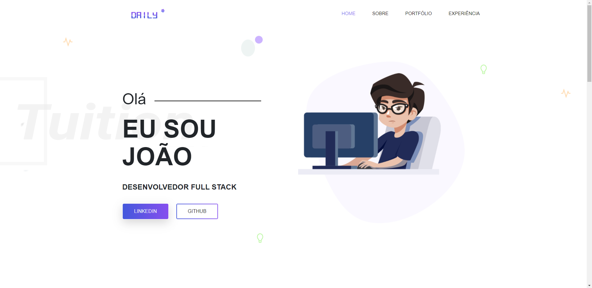
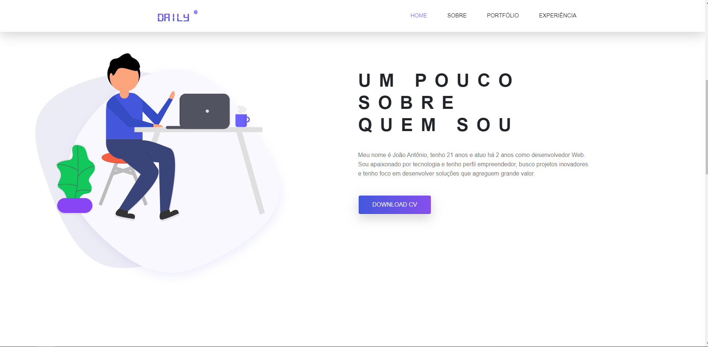
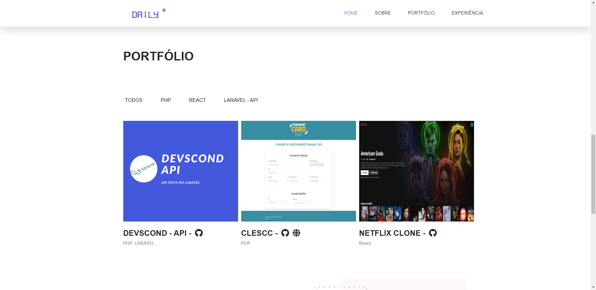
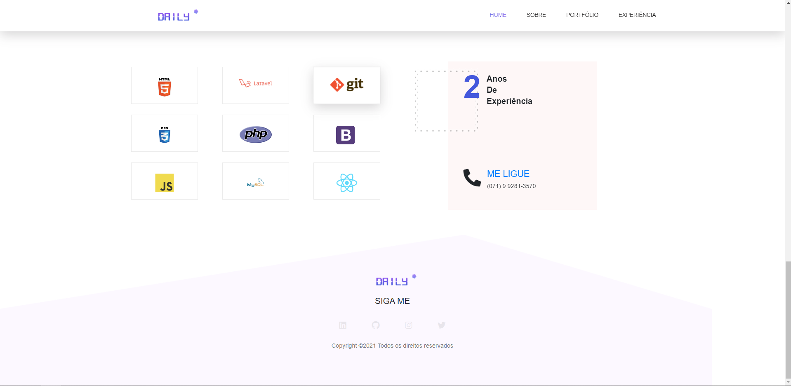

<h1 align="center">:pencil: Portfolio :pencil:</h1>

O Portfolio foi desenvolvimento com o intuito de agregar como mais um meio de propagar os meus projetos e mostrar os meus talentos.

## :camera: Demonstração

    
    
    
    

 

## :tv: Video Demonstrativo

---

## 🚀 Tecnologias

Este projeto foi desenvolvido com as seguintes tecnologias:

- ✔️ Bootstrap

- ✔️ JavaScript

- ✔️ Html

- ✔️ Csss

- ✔️ OWL-Carrousel

Feito com 💜 por JOÃO OLIVEIRA 👋 [Veja meu Linkedin](https://www.linkedin.com/in/joao-php/)
 

